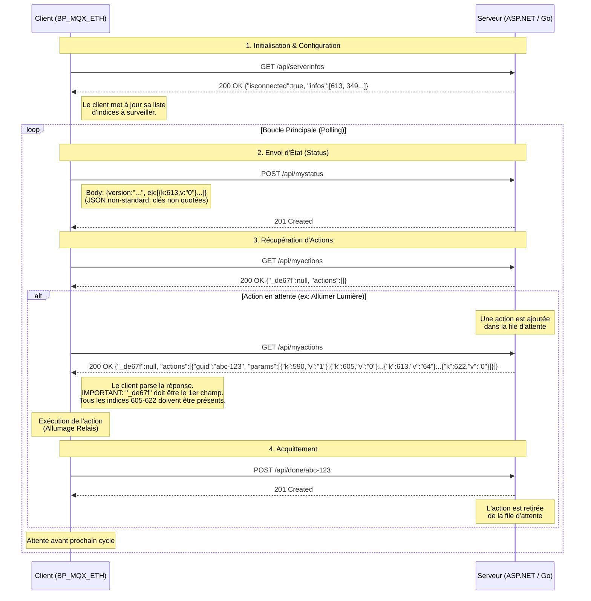

# Diagramme de Séquence : Protocole Client Essensys <-> Serveur

Ce diagramme illustre les échanges HTTP entre le boîtier client (`BP_MQX_ETH`) et le serveur (ASP.NET ou notre implémentation Go/Python).



## Points Clés du Protocole

1.  **Format JSON Strict** : Le client C utilise un parser manuel (`strstr`).
    *   Pour `GET /api/myactions`, le champ `_de67f` **DOIT** être présent et placé **avant** le champ `actions`.
    *   Exemple valide : `{"_de67f":null,"actions":[...]}`
    *   Exemple invalide : `{"actions":[...],"_de67f":null}`

2.  **Mise à jour par Bloc Complet** : Pour les actions (lumières/volets), le client attend **tous les indices de la plage 605 à 622** dans le tableau `params`, ainsi que l'indice **590** (Scénario) à "1". Si des indices manquent, l'action risque d'être ignorée.

3.  **JSON Non-Standard** : Le client envoie des requêtes `POST /api/mystatus` avec des clés non quotées (ex: `{k:12,v:"1"}`). Le serveur doit nettoyer ce JSON avant de le parser.

4.  **Headers** : Le client s'attend à recevoir un `Content-Type: application/json ;charset=UTF-8` (avec l'espace avant le point-virgule) dans certaines versions.

## Logique Client (Code C)

Analyse de la fonction `sc_DialogueAvecServeur` dans `www.c` :

```mermaid
graph TD
    Start[Début Cycle] --> Step1{GET /api/serverinfos}
    
    Step1 -- OK (200) --> Wait1[Attente]
    Step1 -- Erreur --> End[Fin Cycle (Erreur)]
    
    Wait1 --> Step2{POST /api/mystatus}
    
    Step2 -- OK (201 Created) --> Wait2[Attente]
    Step2 -- Erreur (ex: 400/500) --> End
    Note2[IMPORTANT: Si mystatus échoue,<br/>myactions n'est JAMAIS appelé] -.-> Step2
    
    Wait2 --> Step3{GET /api/myactions}
    
    Step3 -- OK (200) --> ProcessActions[Traitement Actions]
    Step3 -- Erreur --> End
    
    ProcessActions --> Step4{POST /api/done}
    
    Step4 --> CheckUpdate{Mise à jour ?}
    CheckUpdate -- Oui --> Download[Téléchargement Firmware]
    CheckUpdate -- Non --> End
```

**Observation Critique** :
Le client exécute ces étapes de manière séquentielle. Si `POST /api/mystatus` ne reçoit pas **exactement** `201 Created`, le client considère cela comme une erreur et **n'appelle pas** `GET /api/myactions`. C'est pourquoi il est vital que le serveur accepte le JSON "malformé" du status et renvoie 201.
